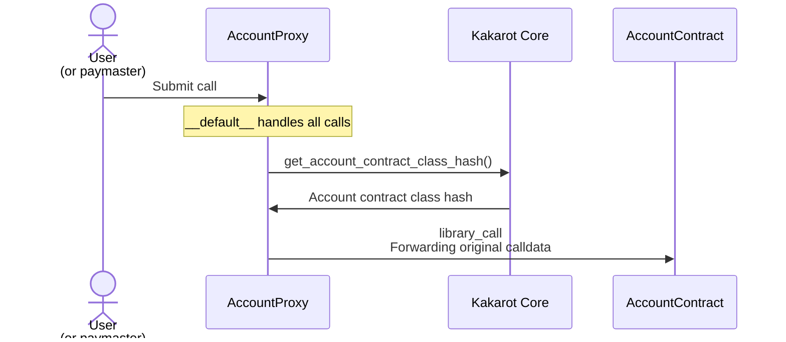
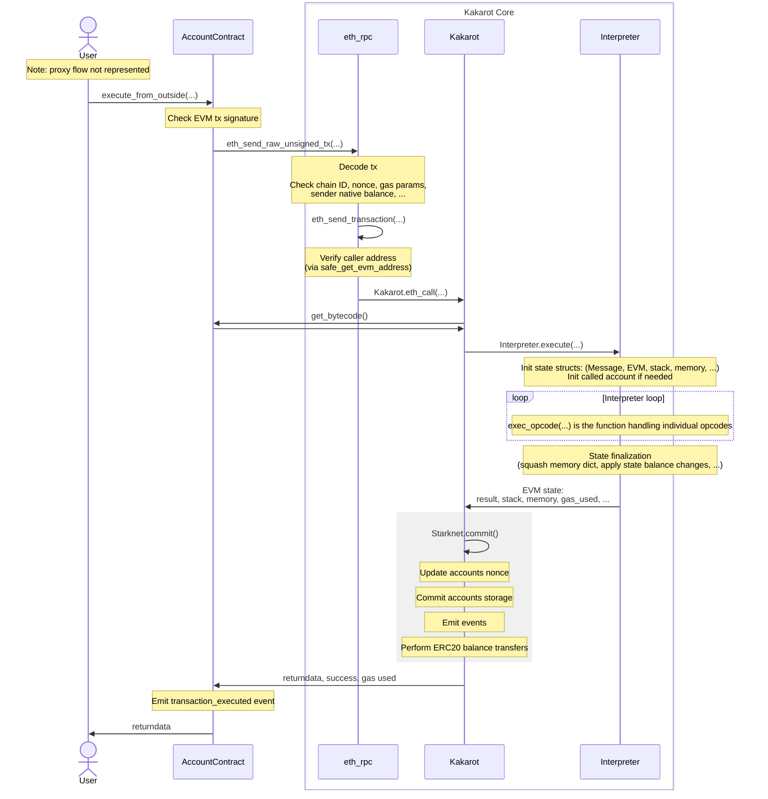

# Kakarot audit details
- Total Prize Pool: $170,000 in USDC
  - HM awards: $93,400 in USDC
  - Z Pool (Zenith side pool): $45,000 in USDC
  - [Audit Catalyst](https://discord.com/channels/810916927919620096/810929015509483554/1286822018334982155) awards: $12,500 in USDC
  - Judge awards: $11,200 in USDC
  - Validator awards: $7,400 in USDC
  - Scout awards: $500 in USDC
- [Read our guidelines for more details](https://docs.code4rena.com/roles/wardens)
- Starts September 27, 2024 20:00 UTC
- Ends October 25, 2024 20:00 UTC

**Z Pool and Dark Horse Bonus Pool**
- This audit includes two [Zenith](https://code4rena.com/zenith) Researchers (ZRs), who are designated as leads for the audit ("LZRs").
- Dark Horse wardens earn a portion of the Z pool by outperforming (or tying) the top-ranked LZR auditor based on [Gatherer score](https://docs.code4rena.com/awarding/incentive-model-and-awards#bonuses-for-top-competitors). 
- For more details, see [Z Pool / Dark Horse bonus pool distribution rules](https://docs.code4rena.com/awarding/incentive-model-and-awards#z-pools-and-dark-horse-bonuses)

ℹ️ While there are no QA awards, QA reports are encouraged as a fallback in the event of no valid HMs. 

## Automated Findings / Publicly Known Issues

_Note for C4 wardens: Anything included in this `Automated Findings / Publicly Known Issues` section is considered a publicly known issue and is ineligible for awards._

• Front-end components
• Infrastructure relating to the project
• Key custody
• The owner of Kakarot has total admin rights to update classes and write values to account storages.
• EVM Gas not being equivalent to Starknet opcode pricing

Any documented difference between Kakarot and Ethereum in the docs: https://docs.kakarot.org/differences


# Overview

Kakarot is a provable EVM built on the Cairo ZK-VM, Starkware's Turing complete and efficient ZK-VM.

The natural first use case for Kakarot is to be embedded into Starknet, thus making it a MultiVM environment. Starknet effectively becomes EVM compatible; allowing the use of both CairoVM and EVM for builders & users. Additionally, Kakarot Labs strives to push more innovations to the L2 space, participating in governance initiative such as Rollup Improvement Proposals (RIPs) and Rollcall.

For the Starknet community, Kakarot removes any kind of EVM-compatibility barrier to developers seeking to take advantage of Starknet’s scalability. For the broader Ethereum ecosystem, Kakarot accelerates the adoption of provable compute.

For developers on Starknet, this means being able to use EVM programming languages and tools in addition to existing tools on Starknet, therefore vastly expanding their options. Additionally, developers who want to launch an EVM appchain (a chain tailored to their specific app) with Kakarot benefit from the stack being highly auditable, maintainable, and modular!

For EVM native users, this means both access to faster and cheaper transactions on Starknet, as well as better interoperability with the broader Ethereum ecosystem.

## Kakarot is not a rollup

  * Kakarot is not an appchain or a blockchain. Kakarot Labs is deploying an EVM environment on Starknet Mainnet. This EVM environment is fully enshrined & embedded into Starknet L2. Kakarot transactions and blocks are abstractions over Starknet transactions and block under the hood.
  * Kakarot is not an L3, nor an L2. Kakarot Labs is launching an EVM runtime inside Starknet. Long-term, Kakarot Labs will rename the Kakarot initiative on Starknet: "Starknet EVM" to reduce confusion.
  * Kakarot is not privacy preserving. Zero-knowledge technologies can be used for two (non-excluding) purposes, Scaling or Privacy. The underlying proof system used by Cairo is not privacy-preserving.

## Kakarot is an implementation of the EVM in Cairo

Under the hood, Kakarot's core EVM is an implementation of the EVM instruction set in Cairo.

> Cairo is the first Turing-complete language for creating provable programs for general computation.

Cairo is like any a programming language, but made for writing provable software. It means that whatever is written in Cairo is, by design, zk. Note that we use the term zk here in the sense that execution of provable software is "ZK-verifiable", not that it is privacy preserving, or so-called "zero-knowledge". Using Cairo means that we leverage the power of STARKs without having to think about it, it sort of "comes for free" just by using this language and not another high-level language, such as Rust or Python.

Kakarot on Starknet is composed of three parts: the Core EVM in Cairo, an RPC layer (RPC server and EVM indexer) and an underlying host CairoVM client (e.g. Starknet mainnet).

# Code Walkthrough

The Kakarot Labs team gave a code walkthrough, which was recorded and will be published and linked here as soon as it's been edited. 

Here's the [key takeaways from the chat transcript](https://gist.github.com/sockdrawermoney/21a55c3775dfef25c64c0e9a770b0774) <-- lots of links in there.

# Kakarot zkEVM Audit Catalyst

This project includes an [Audit Catalyst](catalyst/README.md) prepared by [Zellic](https://zellic.io) security researcher fcremo. This is an essential read for accelerating your work as an auditor and using your time most effectively in contributing to the security of the project.

## Outline

- [Foundational knowledge](#foundational-knowledge)
  - [Kakarot zkEVM](#kakarot-zkevm)
  - [Fundamentals and recommended background](#fundamentals-and-recommended-background)
    - [Cairo0](#cairo0)
    - [Starknet](#starknet)
    - [EVM](#evm)
- [Project overview](#project-overview)
  - [Core contract](#core-contract)
  - [Account contract](#account-contract)
  - [Account contract deployment](#account-contract-deployment)
  - [Transaction flow](#transaction-flow)
- [Security considerations](#security-considerations)
  - [Notable issue classes](#notable-issue-classes)
    - [EVM equivalence issues](#evm-equivalence-issues)
    - [Arithmetic issues](#arithmetic-issues)
    - [Prover hints without appropriate Cairo constraints](#prover-hints-without-appropriate-cairo-constraints)
    - [Data packing/unpacking, RLP decoding, and transaction parsing](#data-packingunpacking-rlp-decoding-and-transaction-parsing)

# Foundational knowledge

## Kakarot zkEVM 

Kakarot is a zkEVM written in [Cairo0](https://docs.cairo-lang.org/hello_cairo/index.html). The project is aiming for deployment on Starknet Mainnet in Q3 2024. However, it is written to be largely agnostic of Starknet-specific characteristics, and should be easily adapted to allow any CairoVM-based ecosystem to run EVM contracts with minimal to no modifications to existing contracts. The design also allows interoperability between contracts running in the zkEVM and native contracts running in the host CairoVM.

## Fundamentals and recommended background

Recommended prerequisites for effectively auditing Kakarot include:

### Cairo0
**Cairo0**: not to be confused with the more modern, rust-looking Cairo1, Cairo0 is the language used to develop Kakarot. 

It is a relatively low-level language, and due to the atypical constraints posed by the zero-knowledge VM environment in which it runs (the CairoVM), it has several design choices that will be surprising to the uninitiated. Documentation about the language can be found [at this link](https://docs.cairo-lang.org/hello_cairo/index.html). 

At times, you may need to reference the standard library souce code, which can be found [in the starkware-libs/cairo-lang](https://github.com/starkware-libs/cairo-lang/tree/master/src/starkware/cairo/common) Github repo. You may find some concepts to be explained more clearly in the [Cairo1 documentation](https://book.cairo-lang.org/ch00-00-introduction.html). Be careful, however, as Cairo1 is significantly different from Cairo0.

### Starknet

**Starknet**: some aspects of Kakarot are tied to Starknet implementation details. Useful readings include documentation about the [transaction lifecycle](https://docs.starknet.io/architecture-and-concepts/network-architecture/transaction-life-cycle/), [the account abstraction interface](https://docs.starknet.io/architecture-and-concepts/accounts/account-functions/), and about [system calls](https://docs.starknet.io/architecture-and-concepts/smart-contracts/system-calls-cairo1/).

### EVM

**EVM**: An in-depth understanding of the EVM design is a must. Vast resources are available, including:
- [the Ethereum Yellowpaper](https://ethereum.github.io/yellowpaper/paper.pdf), which originally defined the EVM
- [evm.codes](https://www.evm.codes/), a handy reference for looking up instruction semantics
- the [go-ethereum](https://github.com/ethereum/go-ethereum/tree/master/core/vm) and [py-evm](https://github.com/ethereum/py-evm/tree/main/eth/vm) implementations, officially sanctioned by the Ethereum Foundation

# Project overview

Kakarot consists of two major logical components: the core contract and the account contract.

### Core contract

The core contract handles transaction parsing and implements the interpreter which executes EVM bytecode. Only one instance of this contract is deployed.

### Account contract

As the name suggests, the account contract represents EVM accounts, both smart contracts and externally owner accounts (EOAs). Each EVM account is represented by a separate instance of the account contract (or more accurately, by an instance of a proxy contract, see the following section) which stores the state of the account, including the nonce, bytecode, and persistent storage. The account balance is not stored in the account contract, since Kakarot uses a Starknet ERC20 token as its EVM-native currency. 

Note that while executing a transaction, information about the state of an account is usually read from the account contract and cached directly by the core contract. The account state is updated by the core contract only when required -- typically when a transaction has finished processing and changes to the account state need to be committed.

### Account contract deployment

[^NOTE: some aspects of contract deployment changed since the code revision audited by Zellic. This description tries to match the current behavior]

One of the Kakarot design goals is to guarantee a deterministic Starknet address for each Kakarot account contract not influenced by the implementation of the account contract. This allows to upgrade the account contract implementation without affecting the Starknet address of a Kakarot EVM account, and to derive the Starknet address of an account contract before it is even deployed and/or off-chain.

It also allows the core contract to authenticate the source of a call and determine whether it originates from a legitimate Kakarot account contract.

To achieve this, Kakarot deploys an instance of a simple account proxy contract to represent each EVM account. When called, the proxy contract obtains the class hash of the actual account contract from the Kakarot core contract and performs a library call (essentially the equivalent of EVM `delegatecall` for Cairo).

The account proxy is always deployed by the core Kakarot contract, setting `deploy_from_zero=FALSE`. The constructor also receives the EVM address represented by the account contract. Therefore, [the Starknet address of an account (proxy) contract](https://github.com/kkrt-labs/kakarot/blob/221b97671ad7cf21d01ee52ffd48f2b7c018ffc5/src/kakarot/account.cairo#L519) depends on the following variables:

- the class hash of the proxy contract
- the address of the Kakarot core contract
- the EVM address represented by the account contract

### Transaction flow

Note: important details of the transaction flow changed since the code revision reviewed by Zellic. This includes changes to the account contract entrypoints and the separation of concerns between the core contract and account contract.

The flow of an EVM transaction into Kakarot is deep and could feel overwhelming at first. This section illustrates the execution path of a normal Ethereum transaction. Some simplifications and omissions needed to be made, but it should give you a good idea of the steps that are taken from the very entry point, right down to the EVM interpreter loop.

The journey starts with the account contract representing the EVM account sending the transaction; to be specific, the first entry point into Kakarot is the [`__default__`](https://github.com/kkrt-labs/kakarot/blob/2b57e602b4380554d09792ff182d9bdc2ad7a619/src/kakarot/accounts/uninitialized_account.cairo#L53) function of the proxy account contract. The proxy retrieves from the core Kakarot contract the class hash of the actual account contract implementation, and library calls if (Starknet equivalent of `delegatecall`ing) forwarding the original calldata. This allows to upgrade the implementation of all account contracts at once. The diagram below shows this flow:



In the case of the Kakarot Starknet deployment, the Starknet transaction typically be initiated by a paymaster account, which will fund the Starknet gas required to process the transaction. Note however that anyone can call the account proxy contract to submit an EVM transaction to Kakarot.

The entry point into the account contract is its [`execute_from_outside`](https://github.com/kkrt-labs/kakarot/blob/2b57e602b4380554d09792ff182d9bdc2ad7a619/src/kakarot/accounts/account_contract.cairo#L96) function. This function performs several checks, including verification of the transaction signature, ensuring the transaction was signed by the private key associated to the public key represented by the account.

After verifying the transaction signature, the account contract calls the Kakarot core contract `eth_rpc` module, specifically the [`eth_send_raw_unsigned_tx`](https://github.com/kkrt-labs/kakarot/blob/2b57e602b4380554d09792ff182d9bdc2ad7a619/src/kakarot/eth_rpc.cairo#L239) function. This function verifies several other properties of the transaction (nonce, chain ID, gas parameters, account balance), and invokes [`eth_send_transaction`](https://github.com/kkrt-labs/kakarot/blob/2b57e602b4380554d09792ff182d9bdc2ad7a619/src/kakarot/eth_rpc.cairo#L188).

`eth_send_transaction` performs another critical check, verifying that the Starknet address of the caller matches the expected Starknet address of the sender of the EVM transaction. This guarantees that the caller is a legitimate Kakarot account contract, and therefore that (modulo critical bugs) the transaction signature was validated correctly.

Execution continues in the Kakarot core [`eth_call`](https://github.com/kkrt-labs/kakarot/blob/2b57e602b4380554d09792ff182d9bdc2ad7a619/src/kakarot/library.cairo#L78) function, which retrieves the bytecode of the contract being called from the corresponding contract account.

Finally, execution reaches the actual virtual machine implementation. The interpreter module [`execute`](https://github.com/kkrt-labs/kakarot/blob/2b57e602b4380554d09792ff182d9bdc2ad7a619/src/kakarot/interpreter.cairo#L820) function initializes all the structures needed to store the execution state ([`Message`](https://github.com/kkrt-labs/kakarot/blob/1b920421b354275e48d101a070d7aa3467eed9b6/src/kakarot/interpreter.cairo#L880), [`Stack`](https://github.com/kkrt-labs/kakarot/blob/1b920421b354275e48d101a070d7aa3467eed9b6/src/kakarot/interpreter.cairo#L899), [`Memory`](https://github.com/kkrt-labs/kakarot/blob/1b920421b354275e48d101a070d7aa3467eed9b6/src/kakarot/interpreter.cairo#L900), [`State`](https://github.com/kkrt-labs/kakarot/blob/1b920421b354275e48d101a070d7aa3467eed9b6/src/kakarot/interpreter.cairo#L901), [`EVM`](https://github.com/kkrt-labs/kakarot/blob/1b920421b354275e48d101a070d7aa3467eed9b6/src/kakarot/interpreter.cairo#L912)).

The interpreter loop is implemented using tail-recursion by the [`run`](https://github.com/kkrt-labs/kakarot/blob/2b57e602b4380554d09792ff182d9bdc2ad7a619/src/kakarot/interpreter.cairo#L739) function, and the individual opcodes are handled by the aptly-named [`exec_opcode`](https://github.com/kkrt-labs/kakarot/blob/2b57e602b4380554d09792ff182d9bdc2ad7a619/src/kakarot/interpreter.cairo#L50).

When execution ends (successfully or not) the state of the accounts involved in the transaction need to be updated. This is mostly handled by a call to `Starknet.commit(...)`, which performs some finalization on the state structures and then updates the state persisted in the account contracts (e.g. updating their nonce or storage), and also performs the actual Starknet ERC20 transfers needed to transfer the native currency used by Kakarot between accounts.

The following diagram summarizes the flow of a transaction from account contract to the interpreter loop and back:


# Security considerations

## Notable issue classes

Due to its very nature, issues in Kakarot are more likely to have a high impact. The core contract attack surface is inevitably large, as it includes an entire VM implementation and an EVM transaction parser, necessarily exposed to malicious interactions. There are also limited applicable defense-in-depth measures, since the core contract is a central trusted component controlling all the EVM state.

This section aims to give you some hints about potential severe issues that may be found in Kakarot. While we don't suggest to limit your search to these issue classes, most of these areas have caused issues in the past and are still a source of concern.

### EVM equivalence issues

Kakarot aims for EVM equivalence -- almost any EVM contract should on Kakarot work as intended without modifications at the source (or even bytecode) level. Excluding [some known edge cases](https://docs.kakarot.org/differences/), any difference in behavior between Kakarot and geth is likely to be a valid issue. Kakarot is already tested using the Ethereum Foundation testsuite, ensuring instruction semantics match the EVM spec. Despite being testsuite-compliant, Zellic manual review revealed a few edge cases not covered by the EF testsuite (see findings 3.6 and 3.7). Additionally, Kakarot compatibility extends beyond the VM to how Ethereum transactions are parsed. Zellic manual review found several critical issues in transaction parsing.

Differential fuzzing seems a promising approach for finding differences between geth and Kakarot, we encourage you to try!

### Arithmetic issues

Cairo0 is a relatively low level language with several really unforgiving aspects. It operates on field elements (felts), which can represent values modulo [a 252 bit prime](https://docs.cairo-lang.org/how_cairo_works/cairo_intro.html#field-elements). Arithmetic operations are not checked for overflows or underflows. Since the EVM works with 256 bit integers, Kakarot emulates them by making extensive use of the Uint256 type, which represents a 256 bit number using two 128 bit felts.

The Zellic review found several issues, including:

- overflows and underflows when operating on two felts (e.g. finding 3.13)
- overflows when converting between Uint256 and felts (e.g. finding 3.10)
- unsafe Uint256 construction (using felts greater than 128 bits) (e.g. finding 3.17)

### Prover hints without appropriate Cairo constraints

One of the most fundamental concepts in zero knowledge smart contract development is the role of the prover and the verifier. In ZK environments like Starknet, smart contracts define constraints which are -- with a huge simplification -- ultimately translated to mathematical equations. A prover is responsible for providing inputs (proofs) that satisfy these equations. Verifiers maintain the network consensus by checking that the proofs provided by the provers are valid.

Cairo allows to specify [hints](https://docs.cairo-lang.org/how_cairo_works/hints.html), snippets of code that help the prover to generate proofs. Hints are not part of the smart contract, and verifiers are completely unaware of their existence. A prover can follow a hint, but is not required to do so. Each hint typically requires appropriate assertions to ensure the prover is not acting maliciously.

Zellic audit discovered several issues in this class (findings 3.2, 3.4, 3.8, 3.20), which were patched by the Kakarot team. They also implemented [convenient testing harnesses](https://github.com/kkrt-labs/kakarot/blob/c7896d0f23cb752f02d93743152e597d57086426/tests/utils/hints.py#L36) which allow to replace hints when running the Kakarot testsuite. We encourage you to experiment with it, you may find other similar issues! 

### Data packing/unpacking, RLP decoding, and transaction parsing

Kakarot typically stores bytestreams as an array of felts, efficiently packing multiple bytes (up to 31) into each felt. This includes the bytecode of a contract, or the bytestream of an incoming transaction. When needed, packed bytes felt arrays are unpacked to a longer array of felts where each element represents a single byte.

Once unpacked, transaction data needs to be decoded from [Recursive Length Prefix format (RLP)](https://ethereum.org/en/developers/docs/data-structures-and-encoding/rlp/). The Kakarot RLP decoder and the packing/unpacking routines were sources of multiple issues (including 3.2, 3.3, 3.4, 3.12), especially related to length checks. The most common root causes of high severity issues were integer overflows and the lack of input length checks leading to out of bound reads/TOCTOUs.

Once the input bytestream is decoded into a stream of RLP items, their structure needs to be validated to ensure it represents a valid Ethereum transaction. This is another possible source of issues worth focusing on (ref. Zellic issues 3.5 and 3.16).


## Links

- **Previous audits:**   [Zellic Audit Report](https://github.com/kkrt-labs/kakarot/blob/main/audits/Kakarot%20EVM%20-%20Zellic%20Audit%20Report.pdf)
- **Documentation:** https://docs.kakarot.org/
- **Website:** https://www.kakarot.org/
- **X/Twitter:** https://x.com/KakarotZkEvm
- **Discord:** https://discord.com/invite/kakarotzkevm

---

# Scope


### Files in scope


### Kakarot (Commit: 697100af34444b3931c18596cec56c454caf28ed)
| Contract                                                                                                                                                                                                | SLOC      |
| ------------------------------------------------------------------------------------------------------------------------------------------------------------------------------------------------------- | --------- |
| [src/utils/utils.cairo](https://github.com/kkrt-labs/kakarot/blob/697100af34444b3931c18596cec56c454caf28ed/src/utils/utils.cairo)                                                                       | 815       |
| [src/utils/eth_transaction.cairo](https://github.com/kkrt-labs/kakarot/blob/697100af34444b3931c18596cec56c454caf28ed/src/utils/eth_transaction.cairo)                                                   | 247       |
| [src/utils/bytes.cairo](https://github.com/kkrt-labs/kakarot/blob/697100af34444b3931c18596cec56c454caf28ed/src/utils/bytes.cairo)                                                                       | 237       |
| [src/utils/maths.cairo](https://github.com/kkrt-labs/kakarot/blob/697100af34444b3931c18596cec56c454caf28ed/src/utils/maths.cairo)                                                                       | 21        |
| [src/utils/dict.cairo](https://github.com/kkrt-labs/kakarot/blob/697100af34444b3931c18596cec56c454caf28ed/src/utils/dict.cairo)                                                                         | 104       |
| [src/utils/signature.cairo](https://github.com/kkrt-labs/kakarot/blob/697100af34444b3931c18596cec56c454caf28ed/src/utils/signature.cairo)                                                               | 29        |
| [src/utils/rlp.cairo](https://github.com/kkrt-labs/kakarot/blob/697100af34444b3931c18596cec56c454caf28ed/src/utils/rlp.cairo)                                                                           | 86        |
| [src/utils/uint256.cairo](https://github.com/kkrt-labs/kakarot/blob/697100af34444b3931c18596cec56c454caf28ed/src/utils/uint256.cairo)                                                                   | 282       |
| [src/utils/array.cairo](https://github.com/kkrt-labs/kakarot/blob/697100af34444b3931c18596cec56c454caf28ed/src/utils/array.cairo)                                                                       | 92        |
| [src/backend/starknet.cairo](https://github.com/kkrt-labs/kakarot/blob/697100af34444b3931c18596cec56c454caf28ed/src/backend/starknet.cairo)                                                             | 233       |
| [src/kakarot/storages.cairo](https://github.com/kkrt-labs/kakarot/blob/697100af34444b3931c18596cec56c454caf28ed/src/kakarot/storages.cairo)                                                             | 35        |
| [src/kakarot/instructions/push_operations.cairo](https://github.com/kkrt-labs/kakarot/blob/697100af34444b3931c18596cec56c454caf28ed/src/kakarot/instructions/push_operations.cairo)                     | 32        |
| [src/kakarot/instructions/stop_and_math_operations.cairo](https://github.com/kkrt-labs/kakarot/blob/697100af34444b3931c18596cec56c454caf28ed/src/kakarot/instructions/stop_and_math_operations.cairo)   | 416       |
| [src/kakarot/instructions/environmental_information.cairo](https://github.com/kkrt-labs/kakarot/blob/697100af34444b3931c18596cec56c454caf28ed/src/kakarot/instructions/environmental_information.cairo) | 380       |
| [src/kakarot/instructions/sha3.cairo](https://github.com/kkrt-labs/kakarot/blob/697100af34444b3931c18596cec56c454caf28ed/src/kakarot/instructions/sha3.cairo)                                           | 67        |
| [src/kakarot/instructions/logging_operations.cairo](https://github.com/kkrt-labs/kakarot/blob/697100af34444b3931c18596cec56c454caf28ed/src/kakarot/instructions/logging_operations.cairo)               | 59        |
| [src/kakarot/instructions/block_information.cairo](https://github.com/kkrt-labs/kakarot/blob/697100af34444b3931c18596cec56c454caf28ed/src/kakarot/instructions/block_information.cairo)                 | 159       |
| [src/kakarot/instructions/duplication_operations.cairo](https://github.com/kkrt-labs/kakarot/blob/697100af34444b3931c18596cec56c454caf28ed/src/kakarot/instructions/duplication_operations.cairo)       | 22        |
| [src/kakarot/instructions/memory_operations.cairo](https://github.com/kkrt-labs/kakarot/blob/697100af34444b3931c18596cec56c454caf28ed/src/kakarot/instructions/memory_operations.cairo)                 | 432       |
| [src/kakarot/instructions/system_operations.cairo](https://github.com/kkrt-labs/kakarot/blob/697100af34444b3931c18596cec56c454caf28ed/src/kakarot/instructions/system_operations.cairo)                 | 983       |
| [src/kakarot/instructions/exchange_operations.cairo](https://github.com/kkrt-labs/kakarot/blob/697100af34444b3931c18596cec56c454caf28ed/src/kakarot/instructions/exchange_operations.cairo)             | 24        |
| [src/kakarot/account.cairo](https://github.com/kkrt-labs/kakarot/blob/697100af34444b3931c18596cec56c454caf28ed/src/kakarot/account.cairo)                                                               | 602       |
| [src/kakarot/gas.cairo](https://github.com/kkrt-labs/kakarot/blob/697100af34444b3931c18596cec56c454caf28ed/src/kakarot/gas.cairo)                                                                       | 143       |
| [src/kakarot/errors.cairo](https://github.com/kkrt-labs/kakarot/blob/697100af34444b3931c18596cec56c454caf28ed/src/kakarot/errors.cairo)                                                                 | 750       |
| [src/kakarot/kakarot.cairo](https://github.com/kkrt-labs/kakarot/blob/697100af34444b3931c18596cec56c454caf28ed/src/kakarot/kakarot.cairo)                                                               | 258       |
| [src/kakarot/interpreter.cairo](https://github.com/kkrt-labs/kakarot/blob/697100af34444b3931c18596cec56c454caf28ed/src/kakarot/interpreter.cairo)                                                       | 990       |
| [src/kakarot/precompiles/blake2f.cairo](https://github.com/kkrt-labs/kakarot/blob/697100af34444b3931c18596cec56c454caf28ed/src/kakarot/precompiles/blake2f.cairo)                                       | 434       |
| [src/kakarot/precompiles/ripemd160.cairo](https://github.com/kkrt-labs/kakarot/blob/697100af34444b3931c18596cec56c454caf28ed/src/kakarot/precompiles/ripemd160.cairo)                                   | 841       |
| [src/kakarot/precompiles/precompiles.cairo](https://github.com/kkrt-labs/kakarot/blob/697100af34444b3931c18596cec56c454caf28ed/src/kakarot/precompiles/precompiles.cairo)                               | 180       |
| [src/kakarot/precompiles/precompiles_helpers.cairo](https://github.com/kkrt-labs/kakarot/blob/697100af34444b3931c18596cec56c454caf28ed/src/kakarot/precompiles/precompiles_helpers.cairo)               | 29        |
| [src/kakarot/precompiles/kakarot_precompiles.cairo](https://github.com/kkrt-labs/kakarot/blob/697100af34444b3931c18596cec56c454caf28ed/src/kakarot/precompiles/kakarot_precompiles.cairo)               | 97        |
| [src/kakarot/precompiles/ec_recover.cairo](https://github.com/kkrt-labs/kakarot/blob/697100af34444b3931c18596cec56c454caf28ed/src/kakarot/precompiles/ec_recover.cairo)                                 | 95        |
| [src/kakarot/precompiles/p256verify.cairo](https://github.com/kkrt-labs/kakarot/blob/697100af34444b3931c18596cec56c454caf28ed/src/kakarot/precompiles/p256verify.cairo)                                 | 40        |
| [src/kakarot/precompiles/sha256.cairo](https://github.com/kkrt-labs/kakarot/blob/697100af34444b3931c18596cec56c454caf28ed/src/kakarot/precompiles/sha256.cairo)                                         | 42        |
| [src/kakarot/precompiles/identity.cairo](https://github.com/kkrt-labs/kakarot/blob/697100af34444b3931c18596cec56c454caf28ed/src/kakarot/precompiles/identity.cairo)                                     | 22        |
| [src/kakarot/events.cairo](https://github.com/kkrt-labs/kakarot/blob/697100af34444b3931c18596cec56c454caf28ed/src/kakarot/events.cairo)                                                                 | 7         |
| [src/kakarot/memory.cairo](https://github.com/kkrt-labs/kakarot/blob/697100af34444b3931c18596cec56c454caf28ed/src/kakarot/memory.cairo)                                                                 | 183       |
| [src/kakarot/accounts/uninitialized_account.cairo](https://github.com/kkrt-labs/kakarot/blob/697100af34444b3931c18596cec56c454caf28ed/src/kakarot/accounts/uninitialized_account.cairo)                 | 66        |
| [src/kakarot/accounts/account_contract.cairo](https://github.com/kkrt-labs/kakarot/blob/697100af34444b3931c18596cec56c454caf28ed/src/kakarot/accounts/account_contract.cairo)                           | 239       |
| [src/kakarot/accounts/library.cairo](https://github.com/kkrt-labs/kakarot/blob/697100af34444b3931c18596cec56c454caf28ed/src/kakarot/accounts/library.cairo)                                             | 445       |
| [src/kakarot/accounts/model.cairo](https://github.com/kkrt-labs/kakarot/blob/697100af34444b3931c18596cec56c454caf28ed/src/kakarot/accounts/model.cairo)                                                 | 18        |
| [src/kakarot/eth_rpc.cairo](https://github.com/kkrt-labs/kakarot/blob/697100af34444b3931c18596cec56c454caf28ed/src/kakarot/eth_rpc.cairo)                                                               | 218       |
| [src/kakarot/state.cairo](https://github.com/kkrt-labs/kakarot/blob/697100af34444b3931c18596cec56c454caf28ed/src/kakarot/state.cairo)                                                                   | 385       |
| [src/kakarot/evm.cairo](https://github.com/kkrt-labs/kakarot/blob/697100af34444b3931c18596cec56c454caf28ed/src/kakarot/evm.cairo)                                                                       | 272       |
| [src/kakarot/library.cairo](https://github.com/kkrt-labs/kakarot/blob/697100af34444b3931c18596cec56c454caf28ed/src/kakarot/library.cairo)                                                               | 307       |
| [src/kakarot/constants.cairo](https://github.com/kkrt-labs/kakarot/blob/697100af34444b3931c18596cec56c454caf28ed/src/kakarot/constants.cairo)                                                           | 1293      |
| [src/kakarot/model.cairo](https://github.com/kkrt-labs/kakarot/blob/697100af34444b3931c18596cec56c454caf28ed/src/kakarot/model.cairo)                                                                   | 126       |
| [src/kakarot/interfaces/interfaces.cairo](https://github.com/kkrt-labs/kakarot/blob/697100af34444b3931c18596cec56c454caf28ed/src/kakarot/interfaces/interfaces.cairo)                                   | 172       |
| [src/kakarot/stack.cairo](https://github.com/kkrt-labs/kakarot/blob/697100af34444b3931c18596cec56c454caf28ed/src/kakarot/stack.cairo)                                                                   | 91        |
| **TOTAL SLOC**                                                                                                                                                                                           | **13100** |


### Kakarot-lib (Commit: c2c7cb400f85c3699a6902946bcf4428d5b4fc61)

| Contract                                                                                                                    | SLOC    |
| --------------------------------------------------------------------------------------------------------------------------- | ------- |
| [src/CairoLib.sol](https://github.com/kkrt-labs/kakarot-lib/blob/c2c7cb400f85c3699a6902946bcf4428d5b4fc61/src/CairoLib.sol) | 124     |
| **TOTAL SLOC**                                                                                                               | **124** |


### Kakarot-ssj (Commit: d4a7873d6f071813165ca7c7adb2f029287d14ca)
| Contract                                                                                                                                                                                                                                            | SLOC     |
| --------------------------------------------------------------------------------------------------------------------------------------------------------------------------------------------------------------------------------------------------- | -------- |
| [crates/contracts/src/cairo1_helpers.cairo](https://github.com/kkrt-labs/kakarot-ssj/blob/d4a7873d6f071813165ca7c7adb2f029287d14ca/crates/contracts/src/cairo1_helpers.cairo)                                                                       | 134      |
| [crates/evm/src/errors.cairo](https://github.com/kkrt-labs/kakarot-ssj/blob/d4a7873d6f071813165ca7c7adb2f029287d14ca/crates/evm/src/errors.cairo)                                                                                                   | 86       |
| [crates/evm/src/precompiles/ec_operations/ec_add.cairo](https://github.com/kkrt-labs/kakarot-ssj/blob/d4a7873d6f071813165ca7c7adb2f029287d14ca/crates/evm/src/precompiles/ec_operations/ec_add.cairo)                                               | 142      |
| [crates/evm/src/precompiles/ec_operations/ec_mul.cairo](https://github.com/kkrt-labs/kakarot-ssj/blob/d4a7873d6f071813165ca7c7adb2f029287d14ca/crates/evm/src/precompiles/ec_operations/ec_mul.cairo)                                               | 115      |
| [crates/evm/src/precompiles/ec_operations.cairo](https://github.com/kkrt-labs/kakarot-ssj/blob/d4a7873d6f071813165ca7c7adb2f029287d14ca/crates/evm/src/precompiles/ec_operations.cairo)                                                             | 72       |
| [crates/evm/src/precompiles/sha256.cairo](https://github.com/kkrt-labs/kakarot-ssj/blob/d4a7873d6f071813165ca7c7adb2f029287d14ca/crates/evm/src/precompiles/sha256.cairo)                                                                           | 141      |
| [crates/utils/src/helpers.cairo](https://github.com/kkrt-labs/kakarot-ssj/blob/d4a7873d6f071813165ca7c7adb2f029287d14ca/crates/utils/src/helpers.cairo) (Only `fn load_word` in scope)                                                              | 230      |
| [crates/utils/src/traits/bytes.cairo](https://github.com/kkrt-labs/kakarot-ssj/blob/d4a7873d6f071813165ca7c7adb2f029287d14ca/crates/utils/src/traits/bytes.cairo) (Only `trait ToBytes<T>`, `trait FromBytes`, `fn pad_right_with_zeroes` in scope) | 552      |
| [crates/utils/src/math.cairo](https://github.com/kkrt-labs/kakarot-ssj/blob/d4a7873d6f071813165ca7c7adb2f029287d14ca/crates/utils/src/math.cairo) (Only `trait Bitshift`, `trait Exponentiation` in scope)                                          | 451      |
| **TOTAL SLOC**                                                                                                                                                                                                                                       | **1923** |


### Files out of scope
All issues referred [here](https://github.com/kkrt-labs/kakarot/issues) and any files not listed in the scope tables are OOS.

## Scoping Q &amp; A

### General questions

| Question                                | Answer                       |
| --------------------------------------- | ---------------------------- |
| ERC20 used by the protocol              |       Starknet's ETH token - an ERC20 defined in https://github.com/starknet-io/starkgate-contracts             |
| Test coverage                           | N/A                         |
| ERC721 used  by the protocol            |            None              |
| ERC777 used by the protocol             |           None                |
| ERC1155 used by the protocol            |              None            |
| Chains the protocol will be deployed on | Starknet  |

### ERC20 token behaviors in scope

| Question                                                                                                                                                   | Answer |
| ---------------------------------------------------------------------------------------------------------------------------------------------------------- | ------ |
| [Missing return values](https://github.com/d-xo/weird-erc20?tab=readme-ov-file#missing-return-values)                                                      |   In scope  |
| [Fee on transfer](https://github.com/d-xo/weird-erc20?tab=readme-ov-file#fee-on-transfer)                                                                  |  Out of scope  |
| [Balance changes outside of transfers](https://github.com/d-xo/weird-erc20?tab=readme-ov-file#balance-modifications-outside-of-transfers-rebasingairdrops) | Out of scope    |
| [Upgradeability](https://github.com/d-xo/weird-erc20?tab=readme-ov-file#upgradable-tokens)                                                                 |   In scope  |
| [Flash minting](https://github.com/d-xo/weird-erc20?tab=readme-ov-file#flash-mintable-tokens)                                                              | Out of scope    |
| [Pausability](https://github.com/d-xo/weird-erc20?tab=readme-ov-file#pausable-tokens)                                                                      | In scope    |
| [Approval race protections](https://github.com/d-xo/weird-erc20?tab=readme-ov-file#approval-race-protections)                                              | Out of scope    |
| [Revert on approval to zero address](https://github.com/d-xo/weird-erc20?tab=readme-ov-file#revert-on-approval-to-zero-address)                            | In scope    |
| [Revert on zero value approvals](https://github.com/d-xo/weird-erc20?tab=readme-ov-file#revert-on-zero-value-approvals)                                    | In scope    |
| [Revert on zero value transfers](https://github.com/d-xo/weird-erc20?tab=readme-ov-file#revert-on-zero-value-transfers)                                    | In scope    |
| [Revert on transfer to the zero address](https://github.com/d-xo/weird-erc20?tab=readme-ov-file#revert-on-transfer-to-the-zero-address)                    | In scope    |
| [Revert on large approvals and/or transfers](https://github.com/d-xo/weird-erc20?tab=readme-ov-file#revert-on-large-approvals--transfers)                  | In scope    |
| [Doesn't revert on failure](https://github.com/d-xo/weird-erc20?tab=readme-ov-file#no-revert-on-failure)                                                   |  In scope   |
| [Multiple token addresses](https://github.com/d-xo/weird-erc20?tab=readme-ov-file#revert-on-zero-value-transfers)                                          | Out of scope    |
| [Low decimals ( < 6)](https://github.com/d-xo/weird-erc20?tab=readme-ov-file#low-decimals)                                                                 |   Out of scope  |
| [High decimals ( > 18)](https://github.com/d-xo/weird-erc20?tab=readme-ov-file#high-decimals)                                                              | Out of scope    |
| [Blocklists](https://github.com/d-xo/weird-erc20?tab=readme-ov-file#tokens-with-blocklists)                                                                | In scope    |

### External integrations (e.g., Uniswap) behavior in scope:


| Question                                                  | Answer |
| --------------------------------------------------------- | ------ |
| Enabling/disabling fees (e.g. Blur disables/enables fees) | No   |
| Pausability (e.g. Uniswap pool gets paused)               |  No   |
| Upgradeability (e.g. Uniswap gets upgraded)               |   No  |


### EIP compliance
None

# Additional context

## Main invariants

- Transactions can only be submitted to Kakarot by the Starknet account corresponding to an EVM account


## Attack ideas (where to focus for bugs)
• Underconstrained computations

• Overflows / Underflows

• Missing range checks

• DoS attacks

## All trusted roles in the protocol

- Owner of the Kakarot Contract

## Describe any novel or unique curve logic or mathematical models implemented in the contracts:

N/A


## Running tests

Follow the instructions in the [README.md](https://github.com/code-423n4/2024-09-kakarot.git) and [CONTRIBUTING.md](https://github.com/code-423n4/2024-09-kakarot.git) guide for environment setup. 

*** Make sure [Rust 1.82 Beta release](https://releases.rs/docs/1.82.0/) is installed and in use. ***

* Clone the repo;
```bash
git clone --recurse https://github.com/code-423n4/2024-09-kakarot.git
```
#### For Kakarot (Commit: 697100af34444b3931c18596cec56c454caf28ed)

```bash
cd 2024-09-kakarot/kakarot
make setup
make install-katana
make build-sol
cp .env.example .env
make run-katana 
make test
```

```bash
curl -L https://install.astral.sh | bash
make build
make build-sol
make run-nodes
make test-unit
```

#### For Kakarot-ssj (Commit: d4a7873d6f071813165ca7c7adb2f029287d14ca)

* Make sure the environment setup is completed as referred [here](https://github.com/kkrt-labs/kakarot-ssj/tree/d4a7873d6f071813165ca7c7adb2f029287d14ca)

```bash
cd kakarot-ssj
scarb build
scarb test
```

* For any Foundry tests, `cd` to the individual commit folder and;
```bash
forge build
forge test
```


## Miscellaneous
Employees of Kakarot and employees' family members are ineligible to participate in this audit.

Code4rena's rules cannot be overridden by the contents of this README. In case of doubt, please check with C4 staff.
