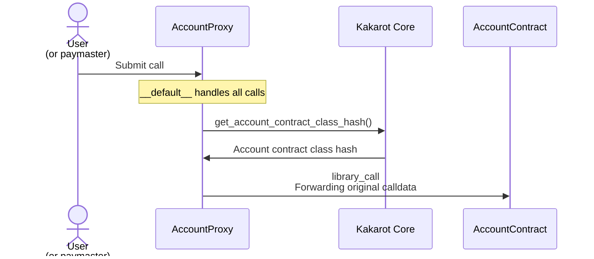
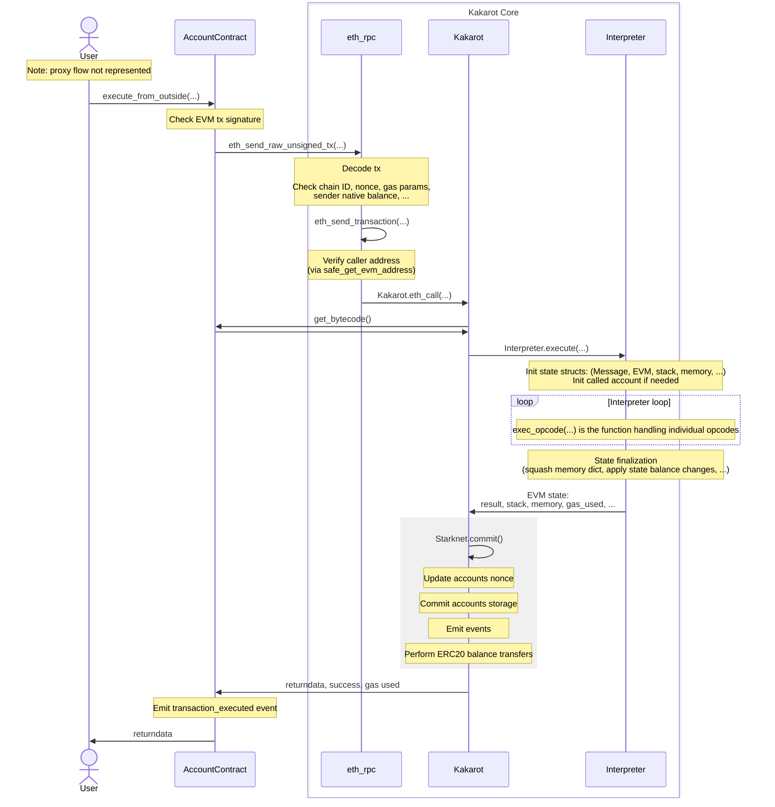

# Project overview

Kakarot consists of two major logical components: the core contract and the account contract.

### Core contract

The core contract handles transaction parsing and implements the interpreter which executes EVM bytecode. Only one instance of this contract is deployed.

### Account contract

As the name suggests, the account contract represents EVM accounts, both smart contracts and externally owner accounts (EOAs). Each EVM account is represented by a separate instance of the account contract (or more accurately, by an instance of a proxy contract, see the following section) which stores the state of the account, including the nonce, bytecode, and persistent storage. The account balance is not stored in the account contract, since Kakarot uses a Starknet ERC20 token as its EVM-native currency. 

Note that while executing a transaction, information about the state of an account is usually read from the account contract and cached directly by the core contract. The account state is updated by the core contract only when required -- typically when a transaction has finished processing and changes to the account state need to be committed.

### Account contract deployment

[^NOTE: some aspects of contract deployment changed since the code revision audited by Zellic. This description tries to match the current behavior]

One of the Kakarot design goals is to guarantee a deterministic Starknet address for each Kakarot account contract not influenced by the implementation of the account contract. This allows to upgrade the account contract implementation without affecting the Starknet address of a Kakarot EVM account, and to derive the Starknet address of an account contract before it is even deployed and/or off-chain.

It also allows the core contract to authenticate the source of a call and determine whether it originates from a legitimate Kakarot account contract.

To achieve this, Kakarot deploys an instance of a simple account proxy contract to represent each EVM account. When called, the proxy contract obtains the class hash of the actual account contract from the Kakarot core contract and performs a library call (essentially the equivalent of EVM `delegatecall` for Cairo).

The account proxy is always deployed by the core Kakarot contract, setting `deploy_from_zero=FALSE`. The constructor also receives the EVM address represented by the account contract. Therefore, [the Starknet address of an account (proxy) contract](https://github.com/kkrt-labs/kakarot/blob/221b97671ad7cf21d01ee52ffd48f2b7c018ffc5/src/kakarot/account.cairo#L519) depends on the following variables:

- the class hash of the proxy contract
- the address of the Kakarot core contract
- the EVM address represented by the account contract

### Transaction flow

Note: important details of the transaction flow changed since the code revision reviewed by Zellic. This includes changes to the account contract entrypoints and the separation of concerns between the core contract and account contract.

The flow of an EVM transaction into Kakarot is deep and could feel overwhelming at first. This section illustrates the execution path of a normal Ethereum transaction. Some simplifications and omissions needed to be made, but it should give you a good idea of the steps that are taken from the very entry point, right down to the EVM interpreter loop.

The journey starts with the account contract representing the EVM account sending the transaction; to be specific, the first entry point into Kakarot is the [`__default__`](https://github.com/kkrt-labs/kakarot/blob/2b57e602b4380554d09792ff182d9bdc2ad7a619/src/kakarot/accounts/uninitialized_account.cairo#L53) function of the proxy account contract. The proxy retrieves from the core Kakarot contract the class hash of the actual account contract implementation, and library calls if (Starknet equivalent of `delegatecall`ing) forwarding the original calldata. This allows to upgrade the implementation of all account contracts at once. The diagram below shows this flow:

In the case of the Kakarot Starknet deployment, the Starknet transaction typically be initiated by a paymaster account, which will fund the Starknet gas required to process the transaction. Note however that anyone can call the account proxy contract to submit an EVM transaction to Kakarot.

The entry point into the account contract is its [`execute_from_outside`](https://github.com/kkrt-labs/kakarot/blob/2b57e602b4380554d09792ff182d9bdc2ad7a619/src/kakarot/accounts/account_contract.cairo#L96) function. This function performs several checks, including verification of the transaction signature, ensuring the transaction was signed by the private key associated to the public key represented by the account.

After verifying the transaction signature, the account contract calls the Kakarot core contract `eth_rpc` module, specifically the [`eth_send_raw_unsigned_tx`](https://github.com/kkrt-labs/kakarot/blob/2b57e602b4380554d09792ff182d9bdc2ad7a619/src/kakarot/eth_rpc.cairo#L239) function. This function verifies several other properties of the transaction (nonce, chain ID, gas parameters, account balance), and invokes [`eth_send_transaction`](https://github.com/kkrt-labs/kakarot/blob/2b57e602b4380554d09792ff182d9bdc2ad7a619/src/kakarot/eth_rpc.cairo#L188).

`eth_send_transaction` performs another critical check, verifying that the Starknet address of the caller matches the expected Starknet address of the sender of the EVM transaction. This guarantees that the caller is a legitimate Kakarot account contract, and therefore that (modulo critical bugs) the transaction signature was validated correctly.

Execution continues in the Kakarot core [`eth_call`](https://github.com/kkrt-labs/kakarot/blob/2b57e602b4380554d09792ff182d9bdc2ad7a619/src/kakarot/library.cairo#L78) function, which retrieves the bytecode of the contract being called from the corresponding contract account.

Finally, execution reaches the actual virtual machine implementation. The interpreter module [`execute`](https://github.com/kkrt-labs/kakarot/blob/2b57e602b4380554d09792ff182d9bdc2ad7a619/src/kakarot/interpreter.cairo#L820) function initializes all the structures needed to store the execution state ([`Message`](https://github.com/kkrt-labs/kakarot/blob/1b920421b354275e48d101a070d7aa3467eed9b6/src/kakarot/interpreter.cairo#L880), [`Stack`](https://github.com/kkrt-labs/kakarot/blob/1b920421b354275e48d101a070d7aa3467eed9b6/src/kakarot/interpreter.cairo#L899), [`Memory`](https://github.com/kkrt-labs/kakarot/blob/1b920421b354275e48d101a070d7aa3467eed9b6/src/kakarot/interpreter.cairo#L900), [`State`](https://github.com/kkrt-labs/kakarot/blob/1b920421b354275e48d101a070d7aa3467eed9b6/src/kakarot/interpreter.cairo#L901), [`EVM`](https://github.com/kkrt-labs/kakarot/blob/1b920421b354275e48d101a070d7aa3467eed9b6/src/kakarot/interpreter.cairo#L912)).

The interpreter loop is implemented using tail-recursion by the [`run`](https://github.com/kkrt-labs/kakarot/blob/2b57e602b4380554d09792ff182d9bdc2ad7a619/src/kakarot/interpreter.cairo#L739) function, and the individual opcodes are handled by the aptly-named [`exec_opcode`](https://github.com/kkrt-labs/kakarot/blob/2b57e602b4380554d09792ff182d9bdc2ad7a619/src/kakarot/interpreter.cairo#L50).

When execution ends (successfully or not) the state of the accounts involved in the transaction need to be updated. This is mostly handled by a call to `Starknet.commit(...)`, which performs some finalization on the state structures and then updates the state persisted in the account contracts (e.g. updating their nonce or storage), and also performs the actual Starknet ERC20 transfers needed to transfer the native currency used by Kakarot between accounts.

The following diagram summarizes the flow of a transaction from account contract to the interpreter loop and back:

